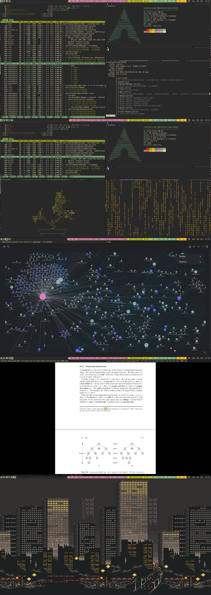

# My configuration files for Arch GNU/Linux

## This repository contains configuration files for the following

- Sway
- Waybar
- Alacritty
- Rofi
- Neovim
- Neofetch

## Example of the resulting environment:

